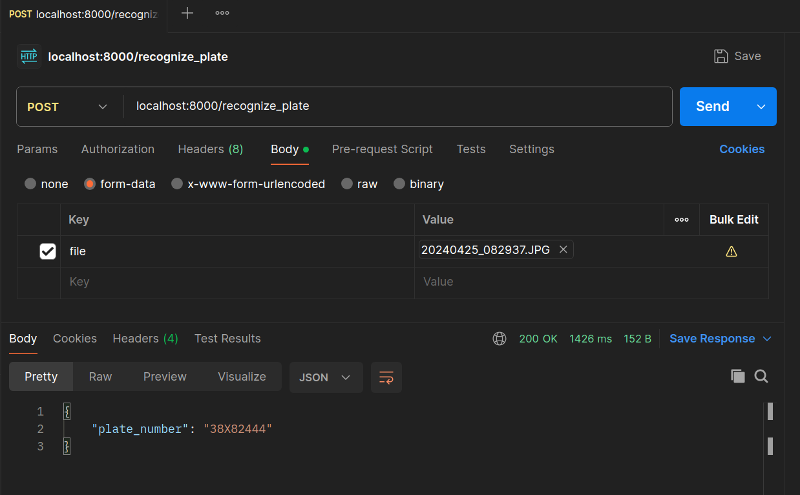

# **License Plate Recognition Project**

## **Overview**

This project implements a license plate recognition system using FastAPI. The system processes images of vehicles to detect and recognize license plates through a four-step pipeline:

1. **Plate Detection:** Utilizes a trained YOLOv8n-pose model (plate\_keypoints\_detector.pt) to detect the four keypoints of the license plate in the input image.

2. **Plate Transformation:** Applies perspective transform to the detected plate, resizing it to a 65x256 image, and performs preprocessing.

3. **Plate Recognition:** Employs a recognition model (license\_plate\_recognition.onnx) to predict the characters on the transformed plate image.

4. **REST API:** Built with FastAPI, allowing users to upload images and receive recognized license plate numbers as JSON responses.

## **Project Structure**

`Project/`  
`│`  
`├── main.py`  
`├── plate_keypoints_detector.pt`  
`├── license_plate_recognition.onnx`  
`├── requirements.txt`  
`└── Dockerfile`

* **main.py:** The main FastAPI application file.  
* **plate\_keypoints\_detector.pt:** YOLOv8 model for detecting license plate keypoints.  
* **license\_plate\_recognition.onnx:** ONNX model for recognizing characters on the transformed plate.  
* **requirements.txt:** Python dependencies required for the project.  
* **Dockerfile:** Docker configuration to containerize and deploy the application.

## **Usage**

### **Installation**

1. Navigate to the project directory on your system: (bash)  
   `cd [location]/A15_MiniProj_LicensePlateRecognition_FastAPI/Project`  
2. Create and activate a virtual environment:  (bash)  
   `python -m virtualenv venv`  
   `` source venv/bin/activate  # On Windows, use `venv\Scripts\activate` ``  
3. Install dependencies:  (bash)  
   `pip install -r requirements.txt`  
   Or just run the following command:  
   `pip install fastapi python-multipart opencv-python-headless numpy ultralytics onnxruntime tensorflow`

### **Running the API**

1. Start the FastAPI server:  (bash)  
   `uvicorn main:app --host 0.0.0.0 --port 8000`   
2. The API will be available at `http://localhost:8000`

### **API Endpoints**

**POST /recognize\_plate**

Recognizes a license plate from an uploaded image.

* **Request**:

  * Method: POST  
  * Content-Type: multipart/form-data  
  * Body:  
    * `file`: Image file (JPG, PNG)

* **Response**:

  * Status Code: 200 OK  
  * Body: JSON object containing the recognized license plate digits

### **Testing with Postman**

1. Open Postman and create a new POST request to `http://localhost:8000/recognize_plate`  
2. Set the request type to `POST`  
3. In the "Body" tab, select "form-data"  
4. Add a key named "file" and set its type to "File"  
5. Upload an image file containing a license plate  
6. Send the request and view the response containing the recognized plate characters
  

In case you preferred to run the project from its `docker container`, read the following:

## **Docker Deployment** 

In case you wanted to use the project from its docker container:

1. Build the Docker image: (bash)  
   `docker build -t license-plate-recognition .`  
2. Run the Docker container: (bash)  
   `docker run -p 8000:8000 license-plate-recognition`  
3. Access the API at [`http://localhost:8000`](http://localhost:8000)  
4. Test with Postman (explained above)

## **Troubleshooting**

If you encounter issues:

* Verify that all dependencies are correctly installed  
* Ensure the model files are in the correct location  
* Check the FastAPI logs for any error messages

For more details, you can check the Related\_Notebooks directory, which includes some of the notebooks related to the process of training and testing models.   
* `1_Playing_around_the_dataset.ipynb` : played around the 1000-YoloDataset which has some images for plate detection.  
* `2_Training_a_Model_for_Plate_Detection_with_Keypoints.ipynb` : trained a yolov8n-pose model to detect plates and their keypoints.   
* `3_Training_a_Model_for_Plate_Recognition.ipynb` : trained a cnn model on iclp-part1 dataset for recognition task.  
* `4_Testing_models_on_a_few_images.ipynb` :  used both of the models for a plate detection and recognition task on a few images. defined a function for this task.   
  
You can observe some of the results in the 4th notebook:  
  
  

