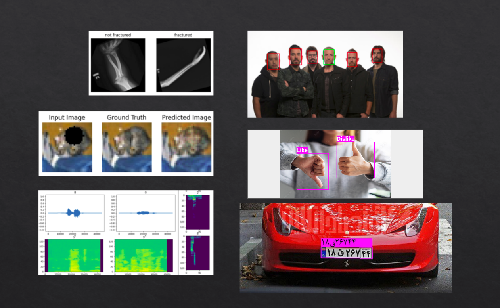

# Deep Learning Projects
My projects for the ClassVison's AI course with focus on Keras &amp; Tensorflow.
  
This repo features handy projects such as:
* bone fracture detection
* hand gesture localization and classification
* text classification using various methods
* face Recognition using fewshot learning
* image inpainting using GAN
* image denoising using autoencoders
* audio classification
* persian licence-plate recognition
* etc.

